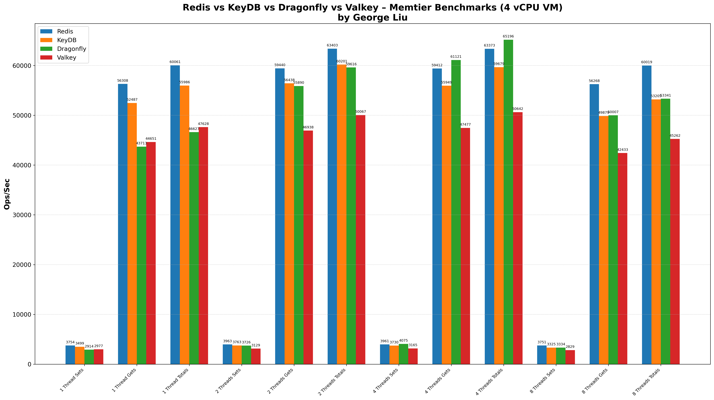
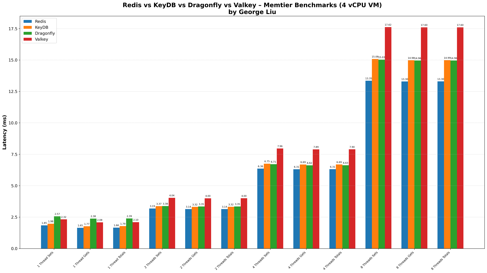
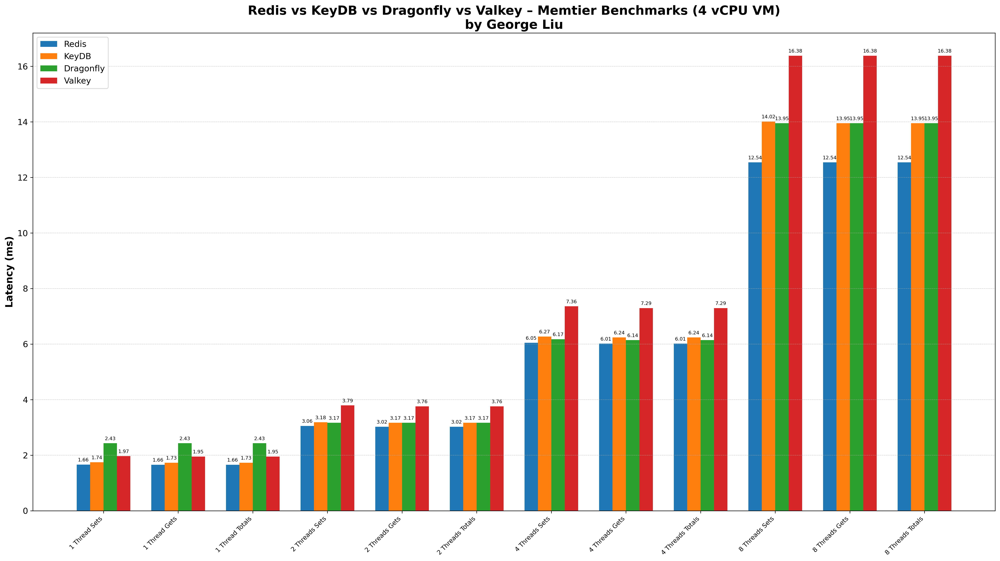
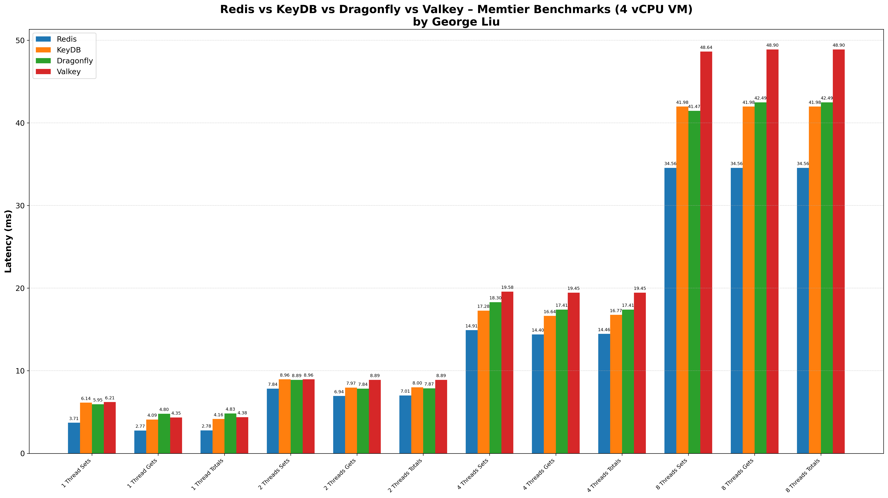

# Redis vs KeyDB vs Dragonfly vs Valkey Performance Comparison

[](https://github.com/centminmod/redis-comparison-benchmarks/actions/workflows/benchmarks.yml)

## Summary

This comprehensive benchmark compares four leading Redis-compatible databases: **Redis**, **KeyDB**, **Dragonfly**, and **Valkey** across various threading scenarios on a 4 vCPU system Azure VPS server with 16GB of memory GitHub Actions Ubuntu hosted runner. Tests used [memtier_benchmark](#https://github.com/RedisLabs/memtier_benchmark).

Previous test comparison results without Valkey can be read [here](readme-v1.md).

### Versions Tested

* Redis 8.0.2
* KeyDB 6.3.4
* Dragonfly 1.30.3
* Valkey 8.1.1

### Key Findings

#### 1. Throughput Analysis (Ops/Sec)

**Single Thread Performance (1 Thread):**
- **Redis**: \~60,061 ops/sec (baseline performance)
- **KeyDB**: \~55,986 ops/sec (slightly lower than Redis)
- **Dragonfly**: \~46,627 ops/sec (lowest single-thread performance)
- **Valkey**: \~47,628 ops/sec (similar to Dragonfly)

**Multi-Thread Scaling (2 Threads):**
- **Redis**: \~63,403 ops/sec (minimal scaling)
- **KeyDB**: \~60,201 ops/sec (good scaling)
- **Dragonfly**: \~59,616 ops/sec (significant improvement)
- **Valkey**: \~50,067 ops/sec (moderate scaling)

**Medium Concurrency (4 Threads):**
- **Redis**: \~63,373 ops/sec (maintains peak performance)
- **KeyDB**: \~59,679 ops/sec (slight performance drop)
- **Dragonfly**: \~65,196 ops/sec (achieves highest throughput)
- **Valkey**: \~50,642 ops/sec (consistent with 2-thread performance)

**High Concurrency (8 Threads):**
- **Redis**: \~60,019 ops/sec (performance degrades)
- **KeyDB**: \~53,205 ops/sec (notable performance drop)
- **Dragonfly**: \~53,341 ops/sec (consistent performance)
- **Valkey**: \~45,262 ops/sec (lowest at high concurrency)

#### 2. Latency Analysis

**Average Latency Performance:**
- **Redis**: Excellent low-latency performance (1.66ms-13.30ms range)
- **KeyDB**: Competitive latency (1.79ms-14.99ms range)
- **Dragonfly**: Higher latency but consistent (2.39ms-14.96ms range)
- **Valkey**: Highest latency across all scenarios (2.10ms-17.60ms range)

**P99 Latency Characteristics:**
- **Redis**: Superior P99 latency control (2.78ms-34.56ms)
- **KeyDB**: Good P99 performance (4.16ms-41.98ms)
- **Dragonfly**: Moderate P99 latency (4.83ms-42.50ms)
- **Valkey**: Highest P99 latency (4.38ms-48.90ms)

#### 3. Threading Behavior Analysis

**Optimal Thread Counts by Database:**
- **Redis**: Peak performance at 1-2 threads, degrades with higher concurrency
- **KeyDB**: Best performance at 2-4 threads, good multi-threading support
- **Dragonfly**: Consistent across all thread counts, scales well to 8 threads
- **Valkey**: Best at 1-2 threads, struggles with high concurrency

### Performance Recommendations

#### Redis
- **Best for**: Single-threaded applications requiring ultra-low latency
- **Sweet spot**: 1-2 threads
- **Pros**: Excellent single-thread performance, mature ecosystem, predictable behavior
- **Cons**: Limited multi-threading benefits, performance degradation at high concurrency

#### KeyDB
- **Best for**: Multi-threaded applications with moderate concurrency requirements
- **Sweet spot**: 2-4 threads
- **Pros**: Good multi-threading support, Redis compatibility, balanced performance
- **Cons**: Performance drops significantly at very high concurrency (8+ threads)

#### Dragonfly
- **Best for**: High-concurrency applications requiring consistent performance
- **Sweet spot**: 4-8 threads
- **Pros**: Excellent scaling characteristics, consistent performance across thread counts
- **Cons**: Higher baseline latency, lower single-thread performance

#### Valkey
- **Best for**: Applications prioritizing Redis compatibility over raw performance
- **Sweet spot**: 1-2 threads
- **Pros**: Redis fork with active development, good single-thread performance
- **Cons**: Highest latency overall, poor scaling beyond 2 threads

## Detailed Benchmark Results

### Non-TLS Performance Comparison









### Complete Benchmark Data

| Database | Threads | Type | Ops/sec | Avg Latency (ms) | p50 Latency (ms) | p99 Latency (ms) |
|----------|---------|------|---------|------------------|------------------|------------------|
| Redis | 1 | Totals | 60,061 | 1.66 | 1.66 | 2.78 |
| Redis | 2 | Totals | 63,403 | 3.14 | 3.02 | 7.01 |
| Redis | 4 | Totals | 63,373 | 6.31 | 6.02 | 14.46 |
| Redis | 8 | Totals | 60,019 | 13.30 | 12.54 | 34.56 |
| KeyDB | 1 | Totals | 55,986 | 1.79 | 1.73 | 4.16 |
| KeyDB | 2 | Totals | 60,201 | 3.32 | 3.17 | 7.99 |
| KeyDB | 4 | Totals | 59,679 | 6.69 | 6.24 | 16.77 |
| KeyDB | 8 | Totals | 53,205 | 14.99 | 13.95 | 41.98 |
| Dragonfly | 1 | Totals | 46,627 | 2.39 | 2.43 | 4.83 |
| Dragonfly | 2 | Totals | 59,616 | 3.35 | 3.17 | 7.87 |
| Dragonfly | 4 | Totals | 65,196 | 6.63 | 6.14 | 17.41 |
| Dragonfly | 8 | Totals | 53,341 | 14.96 | 13.95 | 42.50 |
| Valkey | 1 | Totals | 47,628 | 2.10 | 1.95 | 4.38 |
| Valkey | 2 | Totals | 50,067 | 4.00 | 3.76 | 8.90 |
| Valkey | 4 | Totals | 50,642 | 7.90 | 7.30 | 19.46 |
| Valkey | 8 | Totals | 45,262 | 17.60 | 16.38 | 48.90 |

## Test Configuration

### Memtier Benchmark Parameters
```bash
memtier_benchmark -s 127.0.0.1 --ratio=1:15 -p PORT --protocol=redis 
  -t THREADS --distinct-client-seed --hide-histogram --requests=2000 
  --clients=100 --pipeline=1 --data-size=384 --key-pattern=G:G 
  --key-minimum=1 --key-maximum=1000000 --key-median=500000 --key-stddev=166667
```

### Test Environment
- **Platform**: GitHub Actions Ubuntu Latest (4 vCPU VM)
- **Test Pattern**: 1:15 SET:GET ratio (simulating typical cache usage)
- **Data Size**: 384 bytes per operation
- **Key Distribution**: Gaussian distribution over 1M key space
- **Pipeline**: Disabled (pipeline=1) for realistic PHP/application usage

### Database Configurations

Settings used were for optimal results for respective database servers on 4 vCPU VM instance server.

- **Redis**: `io-threads 2`, `io-threads-do-reads yes`. Setting IO threads to 4, results in lower performance.
- **KeyDB**: `io-threads 2`, `io-threads-do-reads yes`. Setting IO threads to 4, results in lower performance.
- **Dragonfly**: `--proactor_threads=4`
- **Valkey**: `io-threads 2`, `io-threads-do-reads yes`. Setting IO threads to 4, results in lower performance.
- **All databases**: Persistence disabled for pure performance testing

## Conclusion

The benchmark results reveal distinct performance characteristics for each database:

1. **Redis** remains the gold standard for single-threaded, low-latency applications. Redis 8.0 has improved performance over Redis 7.2.
2. **KeyDB** offers the best balance of multi-threading support and Redis compatibility
3. **Dragonfly** excels in high-concurrency scenarios with consistent scaling. Dragonfly seems to scale better at 8+ CPU threads.
4. **Valkey** provides Redis compatibility but with performance trade-offs. Valkey I suspect, like Dragonfly will perform better with more CPU threads available.

Choose based on your specific requirements:
- **Low latency, single-threaded**: Redis
- **Balanced multi-threading**: KeyDB  
- **High concurrency scaling**: Dragonfly
- **Redis compatibility with active development**: Valkey