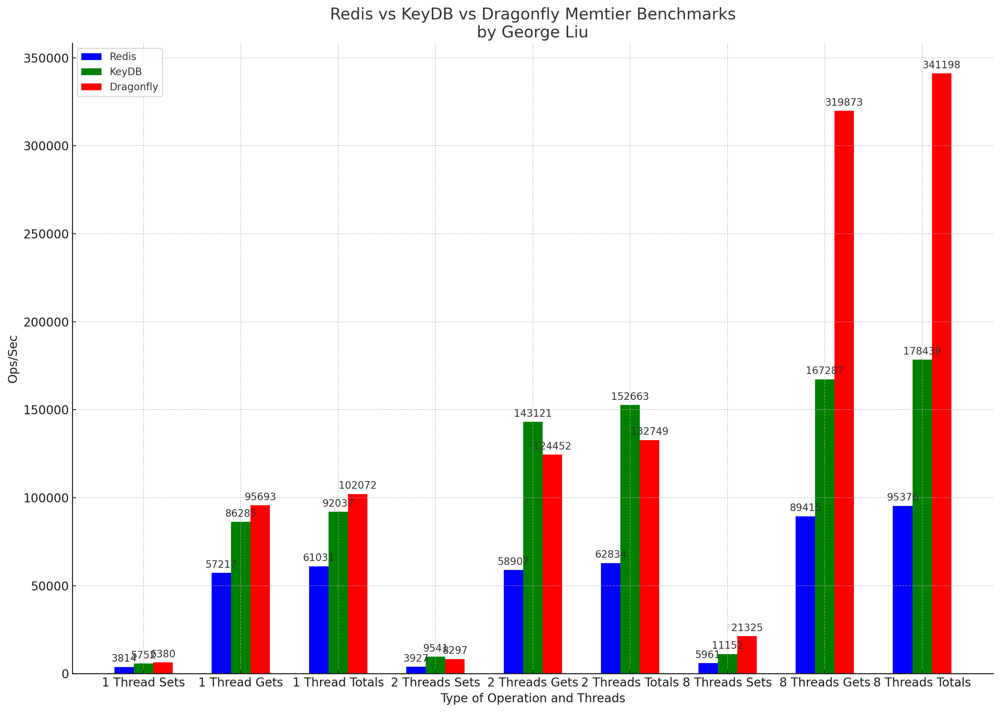
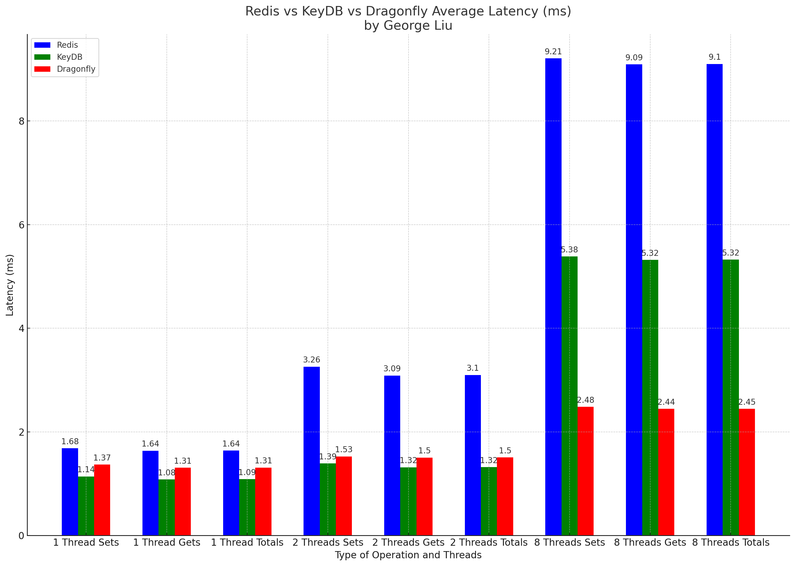
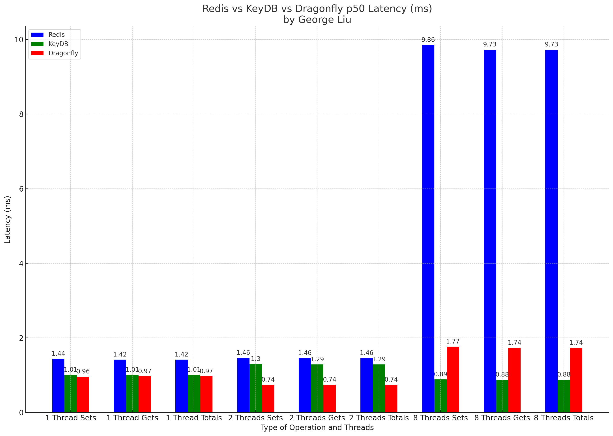
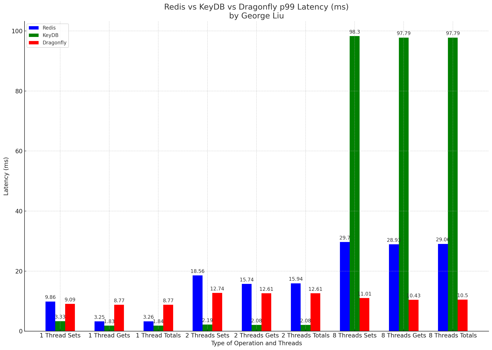
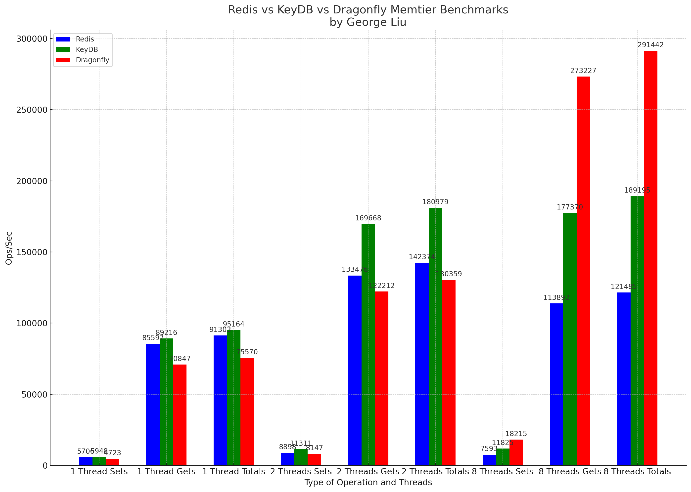
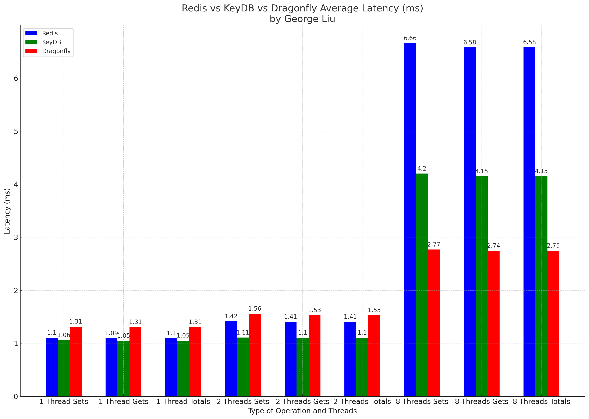
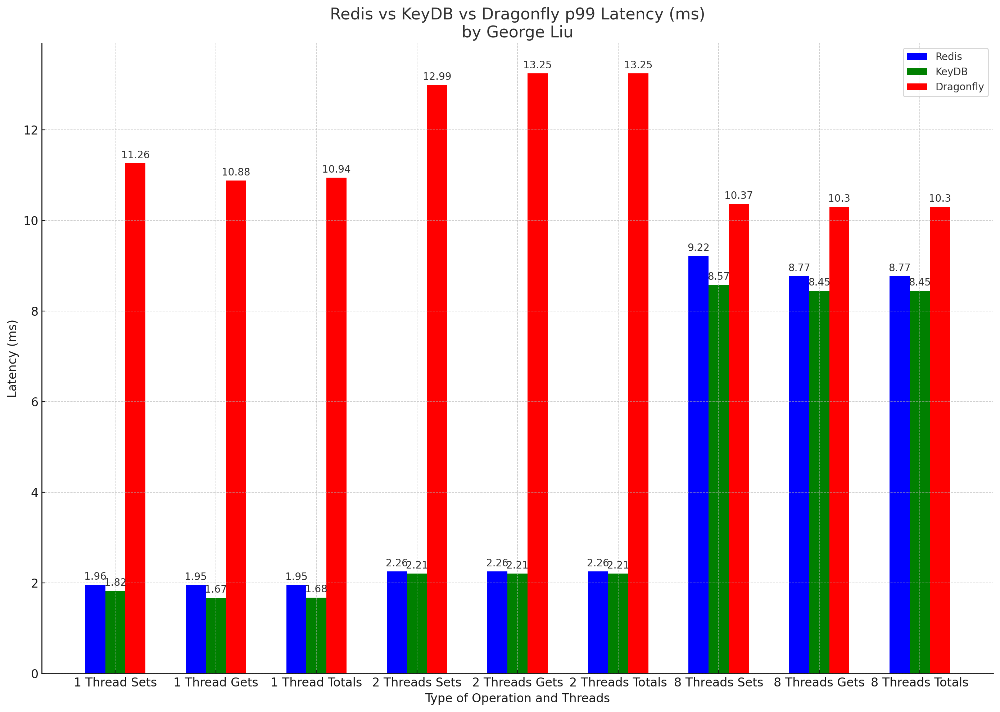

[](https://github.com/centminmod/redis-comparison-benchmarks/actions/workflows/benchmarks.yml)

* [Redis vs KeyDB vs Dragonfly With IO Threads](#redis-vs-keydb-vs-dragonfly-with-io-threads)
* [Redis vs KeyDB vs Dragonfly No IO Threads](#redis-vs-keydb-vs-dragonfly-no-io-threads)

# Summary

1. Ops/Sec (Throughput) Analysis:

* Redis vs KeyDB vs Dragonfly With IO Threads:
  * For single-threaded operations (both Sets and Gets), all three databases have comparable performance.
  * KeyDB outperforms both Redis and Dragonfly significantly in multi-threaded scenarios, especially with 2 threads.
  * Dragonfly surpasses KeyDB and Redis when scaled to 8 threads, especially in Gets operations.
* Redis vs KeyDB vs Dragonfly No IO Threads:
  * The patterns are quite similar to when IO Threads are enabled. However, the throughput is generally lower without IO Threads.
  * KeyDB maintains its lead in the 2 thread scenarios.
  * Again, Dragonfly shows its strength when scaled to 8 threads.

2. Latency Analysis (Avg, p50, p99):

* Redis vs KeyDB vs Dragonfly With IO Threads:
  * KeyDB consistently showcases the lowest latency in almost all scenarios. Its p99 latency is particularly impressive, maintaining low values even under high concurrency.
  * Dragonfly tends to have slightly higher latency than Redis in single-threaded operations but performs better as the number of threads increase.
* Redis vs KeyDB vs Dragonfly No IO Threads:
  * The latency patterns remain fairly consistent with the IO Threads scenario, but the actual latency values are generally higher without IO Threads.
  * KeyDB's strength in latency remains evident, especially in multi-threaded operations.

3. Summary Findings:

* Throughput (Ops/Sec): KeyDB shines in multi-threaded scenarios, especially with 2 threads. Dragonfly, on the other hand, scales impressively with 8 threads. Redis provides consistent performance but doesn't lead in any particular scenario.
* Latency: KeyDB offers the best latency performance across the board. It's particularly noticeable in high concurrency scenarios, where it maintains low p99 latencies. Dragonfly shows promise with increased threads, but its latency isn't as competitive as KeyDB's.

4. Sweet Spots:

* Redis: Best suited for applications that require consistent, predictable performance without the need to scale beyond a few threads. Redis is also a mature product with a vast ecosystem, making it a safe bet for general-purpose caching and storage scenarios.
* KeyDB: Highly recommended for applications that require high throughput with low latency, especially if multi-threading is anticipated. Its performance in 2-thread scenarios is particularly noteworthy.
* Dragonfly: Dragonfly seems to be the go-to for very high concurrency scenarios (like 8 threads). It scales well and might be more suitable for applications that can throw a lot of parallel threads at the database.

# Redis vs KeyDB vs Dragonfly With IO Threads

* Redis and KeyDB configured with `io-threads 12` and `io-threads-do-reads yes`

## Ops/sec



## Avg Latency



## p50 Latency



## p99 Latency



# Redis vs KeyDB vs Dragonfly No IO Threads

## Ops/sec



## Avg Latency


## p50 Latency



## p99 Latency



# Redis Memtier Benchmarks

without IO threads

| Databases | Type | Ops/sec | Hits/sec | Misses/sec | Avg Latency | p50 Latency | p99 Latency | p99.9 Latency | KB/sec |
| --- | --- | --- | --- | --- | --- | --- | --- | --- | --- |
Redis 1 Thread | Sets | 5706.46 | --- | --- | 1.10241 | 0.99100 | 1.95900 | 4.07900 | 2406.80 |
Redis 1 Thread | Gets | 85596.97 | 826.75 | 84770.22 | 1.09486 | 0.99100 | 1.95100 | 3.55100 | 3646.81 |
Redis 1 Thread | Totals | 91303.44 | 826.75 | 84770.22 | 1.09533 | 0.99100 | 1.95100 | 3.59900 | 6053.61 |
Redis 2 Threads | Sets | 8898.39 | --- | --- | 1.41531 | 1.31100 | 2.25500 | 2.78300 | 3753.06 |
Redis 2 Threads | Gets | 133475.85 | 1331.20 | 132144.65 | 1.40604 | 1.30300 | 2.25500 | 3.58300 | 5702.54 |
Redis 2 Threads | Totals | 142374.24 | 1331.20 | 132144.65 | 1.40662 | 1.30300 | 2.25500 | 3.51900 | 9455.60 |
Redis 8 Threads | Sets | 7592.81 | --- | --- | 6.65850 | 6.49500 | 9.21500 | 14.20700 | 3202.41 |
Redis 8 Threads | Gets | 113892.19 | 1126.09 | 112766.10 | 6.57747 | 6.43100 | 8.76700 | 14.46300 | 4862.18 |
Redis 8 Threads | Totals | 121485.00 | 1126.09 | 112766.10 | 6.58254 | 6.43100 | 8.76700 | 14.46300 | 8064.59 |

# Redis Memtier Benchmarks

with `io-threads 12` and `io-threads-do-reads yes`

```

| Databases | Type | Ops/sec | Hits/sec | Misses/sec | Avg Latency | p50 Latency | p99 Latency | p99.9 Latency | KB/sec |
| --- | --- | --- | --- | --- | --- | --- | --- | --- | --- |
Redis 1 Thread | Sets | 3814.44 | --- | --- | 1.68332 | 1.43900 | 9.85500 | 20.73500 | 1608.80 |
Redis 1 Thread | Gets | 57216.58 | 36.92 | 57179.66 | 1.63532 | 1.41500 | 3.24700 | 27.00700 | 2242.78 |
Redis 1 Thread | Totals | 61031.02 | 36.92 | 57179.66 | 1.63832 | 1.41500 | 3.26300 | 27.00700 | 3851.58 |
Redis 2 Threads | Sets | 3927.15 | --- | --- | 3.25753 | 1.46300 | 18.55900 | 23.55100 | 1656.35 |
Redis 2 Threads | Gets | 58907.31 | 112.47 | 58794.84 | 3.08650 | 1.45500 | 15.74300 | 26.11100 | 2337.19 |
Redis 2 Threads | Totals | 62834.47 | 112.47 | 58794.84 | 3.09719 | 1.45500 | 15.93500 | 26.11100 | 3993.54 |
Redis 8 Threads | Sets | 5961.01 | --- | --- | 9.20864 | 9.85500 | 29.69500 | 48.63900 | 2514.17 |
Redis 8 Threads | Gets | 89415.13 | 554.67 | 88860.45 | 9.09222 | 9.72700 | 28.92700 | 50.43100 | 3692.74 |
Redis 8 Threads | Totals | 95376.14 | 554.67 | 88860.45 | 9.09950 | 9.72700 | 29.05500 | 50.43100 | 6206.91 |
```

# KeyDB Memtier Benchmarks

without IO threads

| Databases | Type | Ops/sec | Hits/sec | Misses/sec | Avg Latency | p50 Latency | p99 Latency | p99.9 Latency | KB/sec |
| --- | --- | --- | --- | --- | --- | --- | --- | --- | --- |
KeyDB 1 Thread | Sets | 5947.76 | --- | --- | 1.06011 | 0.98300 | 1.82300 | 4.67100 | 2508.57 |
KeyDB 1 Thread | Gets | 89216.38 | 861.71 | 88354.67 | 1.05024 | 0.98300 | 1.67100 | 3.47100 | 3801.01 |
KeyDB 1 Thread | Totals | 95164.14 | 861.71 | 88354.67 | 1.05086 | 0.98300 | 1.67900 | 3.61500 | 6309.58 |
KeyDB 2 Threads | Sets | 11311.17 | --- | --- | 1.10910 | 0.97500 | 2.20700 | 3.64700 | 4770.69 |
KeyDB 2 Threads | Gets | 169667.52 | 1692.15 | 167975.37 | 1.10304 | 0.97500 | 2.20700 | 3.72700 | 7248.77 |
KeyDB 2 Threads | Totals | 180978.69 | 1692.15 | 167975.37 | 1.10342 | 0.97500 | 2.20700 | 3.71100 | 12019.46 |
KeyDB 8 Threads | Sets | 11824.69 | --- | --- | 4.20102 | 4.12700 | 8.57500 | 12.47900 | 4987.28 |
KeyDB 8 Threads | Gets | 177370.40 | 1753.72 | 175616.68 | 4.14949 | 4.12700 | 8.44700 | 11.96700 | 7572.14 |
KeyDB 8 Threads | Totals | 189195.09 | 1753.72 | 175616.68 | 4.15271 | 4.12700 | 8.44700 | 12.03100 | 12559.42 |

# KeyDB Memtier Benchmarks

with `io-threads 12` and `io-threads-do-reads yes`


| Databases | Type | Ops/sec | Hits/sec | Misses/sec | Avg Latency | p50 Latency | p99 Latency | p99.9 Latency | KB/sec |
| --- | --- | --- | --- | --- | --- | --- | --- | --- | --- |
KeyDB 1 Thread | Sets | 5752.32 | --- | --- | 1.14006 | 1.00700 | 3.32700 | 7.48700 | 2426.14 |
KeyDB 1 Thread | Gets | 86284.73 | 57.06 | 86227.67 | 1.08299 | 1.00700 | 1.83100 | 3.87100 | 3382.71 |
KeyDB 1 Thread | Totals | 92037.05 | 57.06 | 86227.67 | 1.08656 | 1.00700 | 1.83900 | 5.05500 | 5808.85 |
KeyDB 2 Threads | Sets | 9541.41 | --- | --- | 1.38931 | 1.29500 | 2.19100 | 20.73500 | 4024.27 |
KeyDB 2 Threads | Gets | 143121.19 | 273.65 | 142847.55 | 1.31553 | 1.28700 | 2.07900 | 5.24700 | 5678.59 |
KeyDB 2 Threads | Totals | 152662.61 | 273.65 | 142847.55 | 1.32014 | 1.28700 | 2.07900 | 5.95100 | 9702.85 |
KeyDB 8 Threads | Sets | 11152.45 | --- | --- | 5.38483 | 0.88700 | 98.30300 | 127.99900 | 4703.75 |
KeyDB 8 Threads | Gets | 167286.71 | 1059.71 | 166227.00 | 5.31853 | 0.87900 | 97.79100 | 129.02300 | 6917.05 |
KeyDB 8 Threads | Totals | 178439.15 | 1059.71 | 166227.00 | 5.32267 | 0.87900 | 97.79100 | 129.02300 | 11620.80 |

# Dragonfly Memtier Benchmarks 1st Run

Ran with Redis & KeyDB runs no IO threads and Dragonfly was configured with `--proactor_threads=$(nproc)` which = 12 CPU threads.

| Databases | Type | Ops/sec | Hits/sec | Misses/sec | Avg Latency | p50 Latency | p99 Latency | p99.9 Latency | KB/sec |
| --- | --- | --- | --- | --- | --- | --- | --- | --- | --- |
Dragonfly 1 Threads | Sets | 4723.15 | --- | --- | 1.31489 | 0.86300 | 11.26300 | 18.30300 | 1992.07 |
Dragonfly 1 Threads | Gets | 70847.19 | 684.29 | 70162.90 | 1.30760 | 0.86300 | 10.87900 | 17.53500 | 3018.40 |
Dragonfly 1 Threads | Totals | 75570.34 | 684.29 | 70162.90 | 1.30806 | 0.86300 | 10.94300 | 17.66300 | 5010.47 |
Dragonfly 2 Thread | Sets | 8147.44 | --- | --- | 1.55731 | 0.69500 | 12.99100 | 21.37500 | 3436.33 |
Dragonfly 2 Thread | Gets | 122211.58 | 1218.86 | 120992.72 | 1.53052 | 0.68700 | 13.24700 | 21.11900 | 5221.29 |
Dragonfly 2 Thread | Totals | 130359.02 | 1218.86 | 120992.72 | 1.53219 | 0.68700 | 13.24700 | 21.11900 | 8657.62 |
Dragonfly 8 Threads | Sets | 18215.12 | --- | --- | 2.76942 | 2.39900 | 10.36700 | 25.47100 | 7682.56 |
Dragonfly 8 Threads | Gets | 273226.78 | 2701.48 | 270525.30 | 2.74424 | 2.35100 | 10.30300 | 24.83100 | 11664.36 |
Dragonfly 8 Threads | Totals | 291441.90 | 2701.48 | 270525.30 | 2.74581 | 2.35100 | 10.30300 | 24.83100 | 19346.92 |

# Dragonfly Memtier Benchmarks 2nd Run

Ran with Redis & KeyDB runs with IO threads and Dragonfly was configured with `--proactor_threads=$(nproc)` which = 12 CPU threads.

| Databases | Type | Ops/sec | Hits/sec | Misses/sec | Avg Latency | p50 Latency | p99 Latency | p99.9 Latency | KB/sec |
| --- | --- | --- | --- | --- | --- | --- | --- | --- | --- |
Dragonfly 1 Threads | Sets | 6379.52 | --- | --- | 1.36691 | 0.95900 | 9.08700 | 17.40700 | 2690.67 |
Dragonfly 1 Threads | Gets | 95692.75 | 63.80 | 95628.96 | 1.30565 | 0.96700 | 8.76700 | 14.14300 | 3751.74 |
Dragonfly 1 Threads | Totals | 102072.27 | 63.80 | 95628.96 | 1.30948 | 0.96700 | 8.76700 | 14.33500 | 6442.41 |
Dragonfly 2 Thread | Sets | 8296.79 | --- | --- | 1.52514 | 0.74300 | 12.73500 | 20.47900 | 3499.33 |
Dragonfly 2 Thread | Gets | 124451.91 | 235.96 | 124215.95 | 1.50333 | 0.74300 | 12.60700 | 19.96700 | 4937.10 |
Dragonfly 2 Thread | Totals | 132748.71 | 235.96 | 124215.95 | 1.50470 | 0.74300 | 12.60700 | 20.09500 | 8436.42 |
Dragonfly 8 Threads | Sets | 21324.85 | --- | --- | 2.48188 | 1.76700 | 11.00700 | 19.83900 | 8994.15 |
Dragonfly 8 Threads | Gets | 319872.80 | 1959.97 | 317912.83 | 2.44320 | 1.73500 | 10.43100 | 18.68700 | 13201.18 |
Dragonfly 8 Threads | Totals | 341197.65 | 1959.97 | 317912.83 | 2.44562 | 1.73500 | 10.49500 | 18.81500 | 22195.34 |

# Memtier Benchmark Parameters

Test with `1:15` ratio for `SET:GET` so for every SET, 15 GETs and pipeline is disabled with `1` as simulating performance for PHP utilization of Redis, KeyDB and Dragonfly.

```
memtier_benchmark -s IPADDRESS --ratio=1:15 -p 6379 --protocol=redis -t 1 --distinct-client-seed --hide-histogram --requests=2000 --clients=100 --pipeline=1 --data-size=384 | tee ./benchmarklogs/redis_benchmarks_1threads.txt

memtier_benchmark -s IPADDRESS --ratio=1:15 -p 6379 --protocol=redis -t 1 --distinct-client-seed --hide-histogram --requests=2000 --clients=100 --pipeline=1 --data-size=384 | tee ./benchmarklogs/keydb_benchmarks_1threads.txt

memtier_benchmark -s IPADDRESS --ratio=1:15 -p 6379 --protocol=redis -t 1 --distinct-client-seed --hide-histogram --requests=2000 --clients=100 --pipeline=1 --data-size=384 | tee ./benchmarklogs/dragonfly_benchmarks_1threads.txt

memtier_benchmark -s IPADDRESS --ratio=1:15 -p 6379 --protocol=redis -t 2 --distinct-client-seed --hide-histogram --requests=2000 --clients=100 --pipeline=1 --data-size=384 | tee ./benchmarklogs/redis_benchmarks_2threads.txt

memtier_benchmark -s IPADDRESS --ratio=1:15 -p 6379 --protocol=redis -t 2 --distinct-client-seed --hide-histogram --requests=2000 --clients=100 --pipeline=1 --data-size=384 | tee ./benchmarklogs/keydb_benchmarks_2threads.txt

memtier_benchmark -s IPADDRESS --ratio=1:15 -p 6379 --protocol=redis -t 2 --distinct-client-seed --hide-histogram --requests=2000 --clients=100 --pipeline=1 --data-size=384 | tee ./benchmarklogs/dragonfly_benchmarks_2threads.txt

memtier_benchmark -s IPADDRESS --ratio=1:15 -p 6379 --protocol=redis -t 8 --distinct-client-seed --hide-histogram --requests=2000 --clients=100 --pipeline=1 --data-size=384 | tee ./benchmarklogs/redis_benchmarks_8threads.txt

memtier_benchmark -s IPADDRESS --ratio=1:15 -p 6379 --protocol=redis -t 8 --distinct-client-seed --hide-histogram --requests=2000 --clients=100 --pipeline=1 --data-size=384 | tee ./benchmarklogs/keydb_benchmarks_8threads.txt

memtier_benchmark -s IPADDRESS --ratio=1:15 -p 6379 --protocol=redis -t 8 --distinct-client-seed --hide-histogram --requests=2000 --clients=100 --pipeline=1 --data-size=384 | tee ./benchmarklogs/dragonfly_benchmarks_8threads.txt
```

# Test System

* Intel Xeon E-2276G
* 32GB ECC Memory
* 2x 960GB NVMe Raid 1
* AlmaLinux 8.8 with 4.18 Linux Kernel
* Centmin Mod 130.00beta01 LEMP stack

```
lscpu
Architecture:        x86_64
CPU op-mode(s):      32-bit, 64-bit
Byte Order:          Little Endian
CPU(s):              12
On-line CPU(s) list: 0-11
Thread(s) per core:  2
Core(s) per socket:  6
Socket(s):           1
NUMA node(s):        1
Vendor ID:           GenuineIntel
BIOS Vendor ID:      Intel(R) Corporation
CPU family:          6
Model:               158
Model name:          Intel(R) Xeon(R) E-2276G CPU @ 3.80GHz
BIOS Model name:     Intel(R) Xeon(R) E-2276G CPU @ 3.80GHz
Stepping:            10
CPU MHz:             4689.751
CPU max MHz:         4900.0000
CPU min MHz:         800.0000
BogoMIPS:            7584.00
Virtualization:      VT-x
L1d cache:           32K
L1i cache:           32K
L2 cache:            256K
L3 cache:            12288K
NUMA node0 CPU(s):   0-11
Flags:               fpu vme de pse tsc msr pae mce cx8 apic sep mtrr pge mca cmov pat pse36 clflush dts acpi mmx fxsr sse sse2 ss ht tm pbe syscall nx pdpe1gb rdtscp lm constant_tsc art arch_perfmon pebs bts rep_good nopl xtopology nonstop_tsc cpuid aperfmperf tsc_known_freq pni pclmulqdq dtes64 monitor ds_cpl vmx smx est tm2 ssse3 sdbg fma cx16 xtpr pdcm pcid sse4_1 sse4_2 x2apic movbe popcnt tsc_deadline_timer aes xsave avx f16c rdrand lahf_lm abm 3dnowprefetch cpuid_fault epb invpcid_single pti ssbd ibrs ibpb stibp tpr_shadow vnmi flexpriority ept vpid ept_ad fsgsbase tsc_adjust bmi1 avx2 smep bmi2 erms invpcid mpx rdseed adx smap clflushopt intel_pt xsaveopt xsavec xgetbv1 xsaves dtherm ida arat pln pts hwp hwp_notify hwp_act_window hwp_epp md_clear flush_l1d arch_capabilities
```
```
free -mlt
              total        used        free      shared  buff/cache   available
Mem:          31812       10911        9859        1369       11041       19079
Low:          31812       21952        9859
High:             0           0           0
Swap:          4090           1        4089
Total:        35903       10912       13949
```